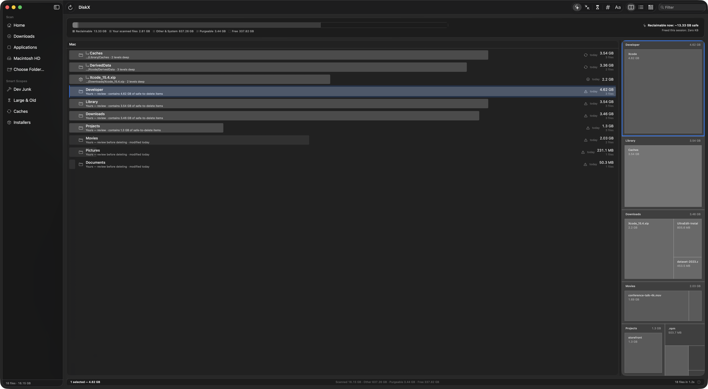
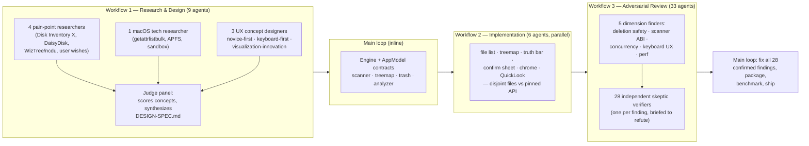

# DiskX

**The WizTree-fast, ncdu-friendly disk visualizer macOS never shipped.**



Every existing analyzer sorts by raw size, which puts `/System` and your Photos Library — the things you cannot or should not touch — at the top, while the 40 GB of Xcode caches you could delete right now sits three levels deep. DiskX's default ordering answers the question users actually ask: **"What should I delete first?"**

## Highlights

- **Reclaim Sort** (default): rows ordered by `reclaimable bytes × safety tier × staleness` — deterministic, inspectable, never AI. The displayed number is always honest gigabytes, never an abstract score. Every row has a plain-language **WHY line** ("Xcode cache — regenerates on next build · untouched 14 months · frees 21.3 GB now").
- **Ghost-row hoisting**: deep junk (`DerivedData`, `node_modules`, …) is hoisted into the current level as `↳ …/Xcode/DerivedData · 6 levels deep` — no repetitive drill-down.
- **Truth Bar**: honest capacity accounting that reconciles with Finder — scanned files, "Other & System" (the System Data mystery, explained), purgeable, free. Plus "Reclaimable now: ~X safe" and a freed-this-session counter.
- **WizTree-class scanning**: parallel `getattrlistbulk` work-stealing pool; hard links deduped by inode; live streaming results — never a blank wait.
- **100 % keyboard**: `↑↓/jk` move · `→/Return` descend · `←/⌘↑` up · `X` mark across folders · `Space` QuickLook · `1–5` sorts · `` ` `` flat Top-Files view · `G` goal mode ("I need 25 GB back") · `?` cheat sheet.
- **Fear-free deletion**: select 1–n items → `Delete` → a keyboard-first confirm sheet. **Return or Y confirms, Esc or N cancels.** Risk-proportional friction: if everything regenerates, one Return suffices; if anything is *yours*, Return goes inert and an explicit `Y` is required. Trash-only (never permanent), app-level `⌘Z` restores the whole batch. Protected system items can never enter the flow.

## Build & run

```bash
swift build            # debug build
swift test             # engine tests
Scripts/package_app.sh # → DiskX.app (reads version.env)
open DiskX.app
```

Grant **Full Disk Access** (System Settings → Privacy & Security) to scan `~/Library` and system paths — DiskX shows an honest "unreadable" chip instead of silently undercounting.

## App Store edition

The Mac App Store build is sandboxed: DiskX scans only locations you grant via the
folder picker (persisted as security-scoped bookmarks), starting from a welcome
screen instead of an automatic Home scan. Ship checklist:

1. **Apple Developer Program** membership; create an app record in App Store Connect
   with the bundle id from [version.env](version.env).
2. Certificates: `Apple Distribution` + `3rd Party Mac Developer Installer`; a Mac
   App Store provisioning profile saved as `Entitlements/DiskX.provisionprofile`.
3. Build the upload package:
   ```bash
   APP_IDENTITY="Apple Distribution: <Team>" \
   INSTALLER_IDENTITY="3rd Party Mac Developer Installer: <Team>" \
   Scripts/package_appstore.sh        # → DiskX-<version>.pkg
   ```
4. Upload with Transporter.app, then fill in screenshots/description/privacy
   ("Data Not Collected" — the app has no telemetry).

Already handled in-repo: App Sandbox entitlements
([Entitlements/DiskX-AppStore.entitlements](Entitlements/DiskX-AppStore.entitlements)),
privacy manifest with required-reason API declarations
([PrivacyInfo.xcprivacy](Sources/DiskX/Resources/PrivacyInfo.xcprivacy)),
app icon (Icon.icns), category/copyright/hi-res Info.plist metadata, and
sandbox-aware scanning (`AccessManager`). Direct distribution (Developer ID +
notarization, no sandbox) keeps full-disk scanning; see the skill scripts
`sign-and-notarize.sh` for that path.

## Appearance

Light, dark, and system themes — Settings (⌘,) → Appearance. All UI uses semantic
colors and Liquid Glass (macOS 26+) with material fallbacks, so both modes are
first-class.

## Architecture

| Target | Contents |
|---|---|
| `DiskXCore` | `ScanSession` (getattrlistbulk pool) · `ReclaimAnalyzer` (tiers, staleness, hotspots) · `TreemapLayout` (squarified) · `TrashEngine` (trash-only, minimal cover) · `FileNode` (lock-guarded live tree) |
| `DiskX` | SwiftUI app: `AppModel` (single brain), global `KeyboardDispatch`, views |
| `diskx-bench` | CLI scan benchmark |

## How it was built — the AI orchestration pipeline

DiskX was developed end-to-end in one session by a multi-agent orchestration
framework: three deterministic workflows fanning out **48 specialized agents**
(~3.3M tokens), coordinated by a main loop that owned the architecture,
integration, and verification.



1. **Research & design** — five researchers swept reviews, Reddit, and HN in
   parallel for the pain points of every existing disk analyzer (22 tool
   findings, 59 explicit user wishes), while a tech agent mapped the fastest
   scanning APIs. Three designers then produced competing concepts from
   different angles, and a judge agent scored them and synthesized the final
   [design spec](docs/DESIGN-SPEC.md) — the origin of Reclaim Sort, the Truth
   Bar, ghost-row hoisting, and risk-proportional deletion.
2. **Parallel implementation** — the main loop first wrote the core engine and
   pinned the `AppModel` API as a contract, then six agents implemented the
   SwiftUI modules concurrently, each owning disjoint files and verifying its
   own diagnostics. Integration and build fixes stayed in the main loop.
3. **Adversarial review** — five finder agents attacked orthogonal dimensions;
   every single finding was handed to an independent verifier instructed to
   *refute* it. 28 findings survived (0 refuted) — including six criticals like
   firmlink double-counting and a cursor/selection desync — and all 28 were
   fixed and re-verified before packaging.

The engine was additionally validated headlessly: 14 unit/integration tests
(including a real Trash round-trip) and a benchmark scanning **1.33M files in
45s (~29,000 files/sec) — 2.4× faster than `du`** on the same tree, with the
reclaim analysis over the whole tree taking a further 1.2s.
